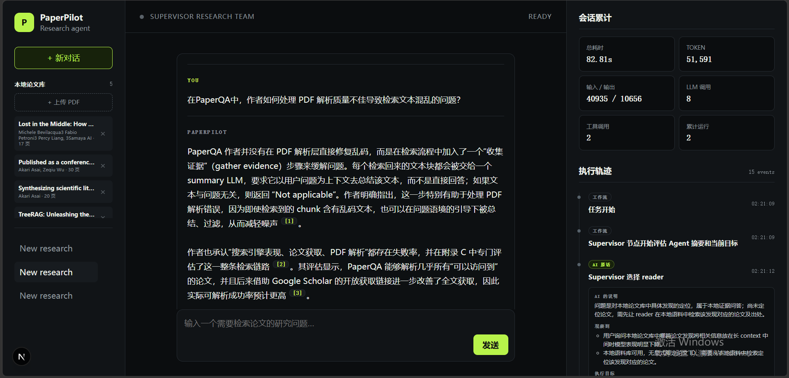
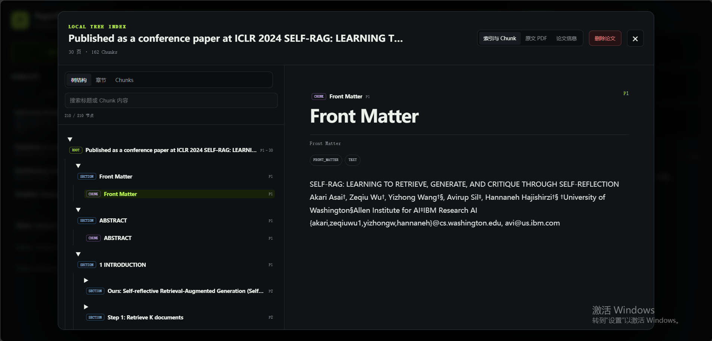

# PaperPilot

PaperPilot 是一个可观测的同步多 Agent 文献研究骨架：Planner 先把用户目标变成显式的任务
计划，Supervisor 再据此在 Search、Reader、Analyst 之间动态选择下一步，最后由 Writer 生成
回答。FastAPI 通过 SSE 返回 LangGraph 执行事件，对话消息、运行、工具调用和关键事件持久化
到 SQLite。

## 界面预览

研究对话页：左侧是本地论文库，中间是问答与可展开的执行轨迹（Planner/Supervisor 决策、
工具调用、覆盖矩阵、引用核验），顶部是模型与 token 指标。



论文库页：已建库论文列表与树索引详情，可展开章节节点、查看 Chunk 原文、页码和图片资产。



## 当前范围

- Next.js + React + strict TypeScript
- FastAPI 异步 API 和 `text/event-stream`
- LangGraph AI 任务规划节点 + Supervisor 路由、Reader 子图（规划/检索/覆盖评估/缺口补检）和统一证据 Judge
- DeepSeek（OpenAI-compatible API）和结构化 Tool Calling
- 固定 `OpenAlex → Semantic Scholar → arXiv` 学术检索回退链、相关性筛选和查询改写
- arXiv PDF 安全下载、受限全文提取和带页码证据的快速阅读
- TreeRAG 风格的科学论文解析、层级 Chunk、祖先标题前缀和 Chroma 向量索引
- 向量召回 ＋ 独立关键词召回的双路检索、RRF 融合、按需树扩展和可配置精排
- 三种任务策略（单篇问答 / 指定多篇比较 / 全库主题研究）各自拥有候选与证据预算
- “论文 × 问题维度”覆盖矩阵、缺口补检和“未找到 / 论文未说明”区分
- 检索评测脚手架：目标论文召回率、证据召回率、维度覆盖率、命中精度和延迟
- 索引指纹：记录 embedding 模型与解析/切块版本，标记需要重建索引的论文
- PDF 上传、全库检索和 Reader 驱动的 RAG 证据阅读
- Search / Reader / Analyst / Writer 职责隔离
- SQLite + SQLAlchemy 2.0 异步持久化
- token 流、阶段摘要、工具参数、论文结果、耗时和 token usage 展示

“思考过程”采用可审计的执行摘要和状态事件表示，不展示或保存模型隐藏的 chain-of-thought。

## 架构边界

```text
frontend
  └─ typed API client + SSE parser + presentation components

backend/app
  ├─ domain           实体、枚举、抽象端口
  ├─ application      用例编排、任务生命周期和 TreeRAG 检索
  ├─ eval             检索评测数据集、指标与报告
  ├─ infrastructure
  │  ├─ agent         LangGraph 图、子图、AI 规划和事件发布
  │  ├─ tools         学术搜索回退链与 PDF 适配器
  │  └─ db            SQLAlchemy 持久化适配器
  ├─ cli              建库、检索、索引指纹检查和评测命令行
  └─ api              FastAPI DTO、依赖和路由
```

当前顶层工作流：

```text
START → Planner → Supervisor ─┬→ Search ────────┐
                              ├→ Reader ────────┤
                              ├→ Analyst ───────┤
                              └→ Writer → END   │
                                                │
                       Search/Reader/Analyst ───┘ 回到 Supervisor
```

Reader 是独立子图：

```text
START → prepare → plan → retrieve → assess ─┬→ synthesize → END
                     │                      │
                     └→ fetch (外部 PDF) ────┘   └→ retrieve_gaps → assess（有界补检循环）
```

Planner 节点在任何检索之前运行一次，产出显式的任务计划：任务类型（fact / comparison /
survey / set_discovery / open）、检索策略、答案维度、目标论文数、比较对象、外部检索与本地
语料需求，以及停止条件。Supervisor 把该计划当作任务策略读取，Reader 把其中的答案维度当作
覆盖维度使用。计划会写入执行轨迹（`stage=planner`），可以审计模型究竟怎样理解任务。
`ENABLE_RESEARCH_PLANNER=false` 可以关闭该节点，此时图从 Supervisor 开始，
Supervisor prompt 会收到 `not planned`。

Supervisor 只产生经过 Pydantic 校验的结构化决策。中间 Agent 返回内存中的
结构化 Artifact，只有 Writer 的最终回答作为 assistant message 持久化并通过 SSE
流式展示。每个中间 Agent 同时产出一份完整报告和一份强类型的 `supervisor_summary`：
Supervisor 只读取后者，不读取、预览或截断完整报告；Reader、Analyst 和 Writer 则按
显式 Artifact ID 获得完整报告，Agent 之间的产物传递不采用字符截断。Supervisor 自己
判断何时进入 Writer；完整回答、有限证据下的部分回答以及外部工具不可用说明都可以是
合理终态，代码不会再因“目标未完全满足”把 Writer 强制改回 Search。
`SUPERVISOR_MAX_STEPS` 只作为防止无限调度的最终安全预算。

Supervisor 的下一步任务使用按 `agent` 区分的联合类型：Search 只接收查询和历史 Search
Artifact；Reader 接收严格限定的阅读目标、`quick/deep` 深度和论文范围，外部论文
额外引用一个 Search Artifact；Analyst/Writer 接收明确的来源 Artifact ID 列表。不同 Agent
的字段不能混用，空列表也不再隐式代表“全部产物”。Reader 的本地范围可以是一篇
（`paper_id`）或多篇（`paper_ids`）；指定多篇时策略不会把它压缩成一篇，而是保留每一个
本地已建库目标，只在没有任何请求论文可读时才回退到补充检索。混合本地/外部目标时只保留
本地论文并记录策略改写；外部 PDF 阅读一次只支持一篇，超出部分会被收窄到第一篇并记录原因。

执行轨迹用来源标签区分 `AI 原话`、`工作流`、`策略规则`、`工具执行` 和`外部结果`。
Supervisor 会输出自己的观察、缺失信息、选择理由和执行目标；如果确定性
策略覆盖模型决定，轨迹会同时保留模型原始选择与策略改写，避免把代码行为伪装成
模型判断。这些内容是模型生成的可审计说明，不是隐藏的逐 Token Chain-of-Thought。

每次用户请求都会创建独立 `AgentRun`，用户消息、AI 消息、指标和事件通过 `run_id`
关联。前端按一轮问答显示本轮耗时、Token、LLM/工具调用以及可展开的执行轨迹；会话级
累计指标仍作为辅助概览保留。

Search 在单个节点内最多执行 `SEARCH_MAX_ITERATIONS` 轮“检索 → 结构化相关性筛选 →
按缺口改写查询”，将论文区分为直接相关、相邻和无关，并把计数、理由和已尝试查询
交给 Supervisor；是否满足整个用户任务仍由 Supervisor 决定。模型只会看到一个
`search_academic_papers` 工具，不能选择数据源。代码固定先查询 OpenAlex；请求失败或
结果为空时查询 Semantic Scholar；仍失败或为空才使用 arXiv。三个客户端都会串行限速，
尊重数值型 `Retry-After`，并对 429/5xx/网络错误执行有限退避重试。每次 provider 尝试
都会进入工具事件与持久化摘要，全部失败时以结构化错误进入 Search 摘要。查询中出现
arXiv ID 时，最终兜底会使用精确 `id_list`，普通关键词则逐项生成 `all:` 字段查询。

Reader 是独立的 LangGraph 子图，节点为 `prepare → plan → retrieve → assess →
(retrieve_gaps → assess)* → synthesize`。窄问题走 `quick` 路径：跳过规划模型，直接用用户
问题作为唯一检索目标并禁止补检；复杂任务走 `deep` 路径：由模型决定检索策略并把目标拆成
子问题。规划输出的 `ReadingPlan` 含 `strategy`、`coverage_dimensions` 和 `sub_questions`；
每个子问题自带检索 query、mode、目标论文和所属维度，因此“比较 A、B、C 的方法与实验”会
变成按“论文 × 维度”组织的检索，而不是一次宽泛查询。子问题在一次检索调用内并行召回，由
检索器统一融合并给出覆盖矩阵。两条路径统一经过 LLM-as-a-Judge，充分性只按用户原问题判断，
而不以全面阅读论文为目标。`deep` 最多执行 `READER_MAX_RETRIEVAL_ROUNDS` 轮；`assess` 节点
逐个裁定候选格子：`covered`（证据确实回答了该维度）、`missing`（证据可能存在但没取到）、
`not_stated`（论文本身没有说明）。检索只会把格子标成 `candidate`，因此 Judge 既能确认候选
也能否定候选——只介绍实验设置、没有任何结果的片段会被判回 `missing`，而不是让覆盖率虚高。
只有判为 `missing` 的格子才会触发 `retrieve_gaps` 做针对性补检，判为 `not_stated` 的格子
直接作为已完成的限制上报。每轮的判断会累积保留，后续轮次可以修正前一轮的结论。
`quick` 完成后直接进入 Writer，不再返回 Supervisor 扩题。Reader 也可以按
Supervisor 指定的 `paper_id` 下载一篇 arXiv PDF，用 `pypdf` 提取带 `PAGE` 标记的受限全文并
快速总结方法、组件、实验、结果和局限。下载大小、页数和输入字符均有配置上限；扫描版 PDF、
复杂版面/公式视觉理解和 OCR 尚不支持，截断及提取警告会进入证据范围。
Reader 的内部计划和证据状态保持结构化，但不再强制生成包含方法、实验和局限的完整
论文报告；元数据足以回答时会跳过 RAG/PDF 下载，最终由 Writer 根据问题范围自然组织
语言，小问题默认直接回答。

独立的论文建库流程不经过在线 Supervisor：`PypdfScientificPaperParser` 使用 PyMuPDF
保留字体、坐标和阅读顺序，自动识别双栏版面，并综合编号、字号、粗体、留白和重复样式
推断章节层级；固定章节名仅用于映射 `methods`、`results` 等语义角色，不再作为主要识别
规则。解析结果会区分正文、caption、表格、图片区域和公式；无边框表格无法可靠恢复单元格
时保留 caption 与邻近原文，而不会把整页误识别成表格。`TreeRagChunker` 按段落语义边界
生成叶节点，表格、图片、公式块保持原子性，并按照 TreeRAG 公式将论文标题与全部祖先章节
标题放在正文之前生成 embedding 输入。根、章节和内容 Chunk 都写入同一 Chroma collection；
原文、父节点、子节点、章节路径、语义角色、版面块类型、对象编号、页码、内容哈希和索引
指纹作为记录或 metadata 保存。

`TreeRagRetriever` 先按任务策略解析预算，再按 Paper Root → Section → Chunk 分层路由论文，
不要求用户或 Agent 预选论文（全局检索时默认按 `RETRIEVAL_PAPER_TOP_K` 路由，survey 策略下
放宽到 `RETRIEVAL_SURVEY_PAPER_TOP_K`）。候选由两条彼此独立的召回通道产生：语义向量召回
（分层召回 ＋ 全库兜底）和关键词召回（对查询词做 `$contains` 过滤后在候选池内用 BM25 排序，
使用真实词频而不是去重后的词表）。两路排名用 RRF（`RETRIEVAL_RRF_CONSTANT`）融合，
因此“向量没取到、关键词能取到”的段落也能进入候选池；论文场景常见的模型缩写、数据集名、
指标名和版本号正是这条通道的目标。融合分数以
`RETRIEVAL_RRF_RANKING_WEIGHT`（默认 0.20）作为初排的加权增益参与排序，而不是替代原始
相似度：纯 RRF 会把任何查询的最佳候选都归一化成 1.0，从而使绝对质量阈值失效。同一片段
被同一子问题的两路同时命中时只累计一次，被多个子问题命中时会累积更高权重。

关键词通道自带边界诊断：每个查询词最多取 `RETRIEVAL_KEYWORD_FILTER_LIMIT`（默认 400）条
记录，BM25 的文档频率与平均长度也只在该候选池内统计。词条命中数触顶时会进入
`keyword_truncated_terms`，所以语料变大后召回损失是可见的，而不是静默发生；真正的全文
反向索引仍是后续工作。

候选随后执行树扩展（按层按需读取子节点，不再加载候选论文的全部节点）、parent-aware 初排
和绝对阈值过滤。多论文比较与全库研究只使用绝对阈值，不用“与最高分相差过大就丢弃”的相对
窗口——比较任务不应该因为另一篇分数更高就丢掉命名的第三篇论文。

在全局候选裁剪之前，每篇目标论文和每个“论文 × 维度”格子先保留自己的最佳候选，之后才按
分数填满候选池；否则排在全局裁剪线之外的论文证据在后续阶段无法找回。预留候选会一直受到
保护：阈值过滤不会丢弃它们，MMR 把它们作为种子加入而不是和普通候选竞争名额，因此“某篇
分数很低”也不会让该篇在后续阶段消失。去重按“论文 ＋ 归一化文本”进行，两篇论文出现相同
文字时各自保留自己的来源。MMR 多样性选择在更宽的候选池上进行，然后才交给精排；每篇裁剪
发生在精排之后，因此精排能看到真正可能有用的候选。最终选择按“覆盖优先、质量其次”执行，
维度按外层、论文按内层轮转，保证排在后面的论文在任何人拿到第二格之前先拿到自己的第一格；
每篇上限会取 `max(RETRIEVAL_MULTI_PAPER_CHUNKS_PER_PAPER, 比较维度数)`，所以三维度比较
不会被两片段上限截断。没有任何命中的目标论文会进入 `missing_paper_ids`。

配置可选的本地 Cross-Encoder 后按**子问题分别精排**：候选按其来源子问题的 query 分组，
每组用该子问题自己的查询打分，再按分数合并，命中里记录 `rerank_query` 便于审计。否则
“比较 A 的方法、B 的结果、C 的局限”会被统一按 A 的方法打分，后面的证据被系统性压低。同一
道理，初排的词法重合度也用候选自己的子问题；`rerank_query`/`matched_queries` 会写进报告。
模型不可用时会在报告中记录原因并安全回退，因此 Top K 是上限而不是必须填满。检索报告会记录
策略、预算（论文数按所有子问题范围的并集计算）、每条子问题、`keyword_candidate_count`、
`keyword_pool_size`、`keyword_truncated_terms`、融合候选数、覆盖矩阵和缺失论文。

覆盖矩阵区分三种状态：`candidate` 表示检索为这个格子取到了片段，`covered` 表示证据已经
核验确实回答了该维度，`not_stated` 表示论文本身没有说明，`missing` 表示证据可能存在但没取到。
检索器只会产出 `candidate`，因为“取到片段”不等于“问题已回答”——片段可能只介绍实验设置而
没有任何结果。核验由 Reader 的 Judge 完成，它可以确认候选、也可以否定候选（把格子降回
`missing` 或判为 `not_stated`），判断跨轮累积且后轮覆盖前轮。`CoverageMatrix.coverage_ratio`
只统计已核验的格子，`candidate_ratio` 另外给出“至少取到候选”的比例。Reader 根据结构化任务
调用检索器，完整 Chunk 证据只进入 Reader Artifact，Supervisor 仍只读取 Reader 摘要
（摘要中包含策略、覆盖矩阵与缺失论文）。

三种任务策略共用同一套索引，但预算与选择规则不同：

| 策略 | 适用任务 | 主要差异 |
|---|---|---|
| `single_paper` | 单篇事实问答 | 相对分差过滤，精准召回，精排后按分数取前 N |
| `multi_paper` | 指定多篇比较 | 每篇保底表征与候选预留，按“论文 × 维度”补格，预算随论文数与维度数增长 |
| `corpus_survey` | 全库主题研究 | 放宽论文路由与最终证据数，逐篇提取后综合并报告检索范围 |

上传的 PDF 和 manifest 保存在 `PAPER_LIBRARY_PATH`，索引保存在 Chroma。manifest 记录索引
指纹（embedding 模型、解析器版本、切块版本、schema 版本），collection 也记录同一指纹。
指纹不匹配是强制执行的：读写命中不匹配的 collection 会直接以
`IndexSignatureMismatchError` 拒绝，并说明应把论文重新写入新的 `VECTOR_COLLECTION`；
`VECTOR_ENFORCE_INDEX_SIGNATURE=false` 可以显式绕过。这样更换同维度但不同空间的 embedding
模型时不会静默混用向量。`python -m app.cli.index_status` 会列出哪些论文需要重建索引，指纹
未知的历史论文不会被误判为过期。

Agent 节点不直接请求外部论文 API，应用服务不直接操作 SQLAlchemy，前端不依赖
LangGraph 的内部事件格式。接口使用 ABC、Pydantic、dataclass、TypedDict 和
TypeScript interface 明确表达。

## 本地启动

### 1. 配置

```powershell
Copy-Item .env.example .env
```

填写 `DEEPSEEK_API_KEY`。OpenAlex 与 Semantic Scholar 的 API key 均为可选配置：
`OPENALEX_API_KEY`、`SEMANTIC_SCHOLAR_API_KEY`；生产或持续使用时建议配置，以获得各自
账户对应的限额。默认模型为 `deepseek-v4-flash`，默认服务地址为
`https://api.deepseek.com`。也支持通用的 `LLM_API_KEY`、`LLM_BASE_URL`、
`LLM_MODEL`，并兼容原有的 `OPENAI_*` 变量名。

### 2. 后端

```powershell
python -m venv backend/.venv
backend/.venv/Scripts/python.exe -m pip install -e "backend[dev]"
backend/.venv/Scripts/python.exe -m uvicorn app.main:app --reload --app-dir backend
```

API 文档位于 `http://localhost:8000/docs`。

### 3. 前端

```powershell
Set-Location frontend
npm install
npm run dev
```

打开 `http://localhost:3000`。

### 4. 将论文写入 TreeRAG 向量索引

建库使用独立的 OpenAI-compatible embedding 配置，不继承聊天模型的 `OPENAI_*` 或
`DEEPSEEK_*`。默认连接本机 Ollama `http://localhost:11434/v1`，并使用
`qwen3-embedding:latest`；Ollama 的 API key 字段必须存在但会被本地服务忽略：

```dotenv
EMBEDDING_API_KEY=ollama
EMBEDDING_BASE_URL=http://localhost:11434/v1
EMBEDDING_MODEL=qwen3-embedding:latest
```

运行建库：

```powershell
Set-Location backend
.venv/Scripts/python.exe -m app.cli.ingest_paper `
  paper/TreeRAG.pdf `
  --paper-id treerag
```

命令会输出页数、章节数、树节点数、内容 Chunk 数和目标 collection，并打印本次建库使用的
索引指纹。重复使用相同 `paper-id` 会 upsert 新节点，并在成功写入后清理该论文已经失效的
旧节点。

检索已入库论文：

```powershell
.venv/Scripts/python.exe -m app.cli.retrieve_paper `
  "How does TreeRAG construct its tree index?" `
  --paper-id treerag `
  --mode method `
  --strategy single_paper
```

`--paper-id` 可以重复传入以检索多篇论文；`--mode` 支持 `fact`、`summary`、`method`、
`compare` 和 `synthesis`；`--strategy` 支持 `single_paper`、`multi_paper` 和
`corpus_survey`，省略时由检索器按论文范围与子问题数推断。`--global` 忽略 `--paper-id`
检索整个库。多论文比较可以用 `--sub-question` 显式给出“论文 × 维度”计划：

```powershell
.venv/Scripts/python.exe -m app.cli.retrieve_paper `
  "Compare the retrieval methods and reported results" `
  --paper-id paper-a --paper-id paper-b --paper-id paper-c `
  --mode compare `
  --sub-question "method=retrieval method and index construction" `
  --sub-question "results=experimental setup datasets metrics results"
```

JSON 结果保留策略、预算、每条子问题、章节路径、页码、原始向量分数、关键词分数、RRF 融合
分数、Cross-Encoder 分数、候选数量、精排状态，候选来自直接向量召回、独立关键词召回还是
树扩展，以及覆盖矩阵和缺失论文。默认仍可使用零额外模型依赖的 parent-aware 排序；如需真正的
本地 Cross-Encoder，执行 `pip install -e ".[reranker]"` 并配置 `RERANKER_MODEL`。Reader 会把
最终 Chunk 构造成稳定编号的 Evidence Library，保留
`evidence_id → chunk_id → paper_id → PDF page` 链路，后续
Reader 报告和 Writer 只能引用其中已有的 Evidence ID。

检查哪些论文需要重建索引：

```powershell
.venv/Scripts/python.exe -m app.cli.index_status
```

命令会对比 collection 与 manifest 记录的索引指纹，输出 `ok`、`unknown-fingerprint`
或 `REBUILD`。更换 embedding 模型或调整解析/切块方式后，旧论文会显示为 `REBUILD`。

## 检索评测

真实检索效果需要真实评测集才能确认。仓库提供评测脚手架和指标定义，
`backend/tests/fixtures/retrieval_eval.sample.json` 只演示数据格式，其中的
paper id 与锚点必须替换成你自己论文集上的标注：

```powershell
.venv/Scripts/python.exe -m app.cli.eval_retrieval `
  tests/fixtures/retrieval_eval.sample.json `
  --output report.json --markdown report.md
```

每个 case 标注 `expected_paper_ids`、`expected_evidence`（paper id ＋ 必须出现的原文
锚点）、`expected_dimensions` 和可选 `sub_questions`。维度覆盖只有在该 case 真的按这些
维度提问时才有意义，所以声明 `expected_dimensions` 的 case 应该同时给出对应的
`sub_questions`，否则这些格子会被如实记为“没有取到候选”。评测输出：

| 指标 | 含义 |
|---|---|
| target paper recall | 该覆盖的论文有没有漏 |
| evidence recall | 标注的证据锚点有没有取到 |
| evidence precision | 返回片段里有多少是标注的正确证据，而不只是来自正确论文 |
| paper source accuracy | 返回片段里有多少来自期望论文 |
| candidate dimension coverage | “论文 × 维度”格子有没有取到候选片段 |
| dimension support rate | 有证据锚点的“论文 × 维度”格子有多少取到了匹配证据 |
| strategy accuracy | 检索策略与标注是否一致 |
| false recall rate | 无答案问题上仍然返回片段的比例 |
| false candidate rate | 无答案问题上仍然产生候选格子的比例 |
| mean / p50 / p95 latency | 单次检索耗时，含分位数 |

`candidate dimension coverage` 是检索侧指标：它只说明检索够到了哪些格子。真正的“问题是否
被回答”需要证据核验，属于 Reader Judge 的判断，因此评测脚手架不会给出核验后的覆盖率，
避免复用同一个乐观判断。`paper source accuracy` 单独存在是因为“来自正确论文”不等于“证据
正确”；`evidence precision` 和 `dimension support rate` 需要标注的锚点（可选带
`dimension`）才有意义。无答案问题用 `expects_answer: false` 标注，只进入
`false recall` / `false candidate` 两个比率，不参与召回类指标——这两个是检索侧的代理指标，
Judge 层面的“错误确认率”需要在 Reader 参与的情况下单独测。
`keyword_truncated_terms` 会随每个 case 记录，用于发现语料变大后关键词通道的召回损失。

对比两次运行（例如加入干扰论文前后、换 embedding 前后）用 `--baseline`：

```powershell
.venv/Scripts/python.exe -m app.cli.eval_retrieval `
  tests/fixtures/retrieval_eval.sample.json `
  --output after.json --baseline before.json
```

命令会输出每个指标的差值，以及每个 case 的命中数、论文召回率、证据召回率变化和“丢了哪些
论文、丢了哪些证据”，并标出 regression / improvement 的 case 列表。这是回答“增加论文后
漏掉了什么、哪一步把证据丢了”的方式：同一份标注集跑两次，看逐 case 差值。

建议的对照实验（每次只改一个变量，其余保持默认）：

| 对照 | 改法 | 想知道什么 |
|---|---|---|
| 纯向量 vs 双路召回 | `RETRIEVAL_KEYWORD_ENABLED=false` | 关键词通道补回了哪些证据 |
| 精排前后 | 配置 `RERANKER_MODEL` | 精排是否把正确证据提前、代价多少延迟 |
| 覆盖补检前后 | `READER_MAX_RETRIEVAL_ROUNDS=1` vs `2` | 补检救回了多少格子 |
| 干扰论文前后 | 向库中追加同领域干扰论文后再跑同一份标注 | 新增语料让哪些 case 退化 |

无答案问题用 `expects_answer: false` 标注后会进入 `false recall rate`，它衡量的是“不该有
答案时是否仍然返回片段”。这项指标需要按真实论文集校准阈值，不要用合成语料上的数字下结论。

验收标准应当是“该覆盖的论文和证据有没有漏”，而不仅是返回的段落是否相关。单篇、多篇和
全库三类任务需要分别标注，指标才有意义。

## API

| Method | Path | Purpose |
|---|---|---|
| `GET` | `/api/v1/health` | 健康检查 |
| `POST` | `/api/v1/conversations` | 创建对话 |
| `DELETE` | `/api/v1/conversations/{id}` | 删除会话及其运行数据 |
| `GET` | `/api/v1/conversations` | 获取持久化对话列表 |
| `GET` | `/api/v1/conversations/{id}/messages` | 获取消息历史（`?include_superseded=true` 可读取被重新生成替换的旧版本） |
| `GET` | `/api/v1/conversations/{id}/metrics` | 获取会话累计指标 |
| `GET` | `/api/v1/conversations/{id}/events` | 获取持久化执行轨迹 |
| `POST` | `/api/v1/conversations/{id}/runs/{run_id}/cancel` | 停止正在执行的任务 |
| `GET` | `/api/v1/conversations/{id}/runs/{run_id}/stream?after=N` | 断线后重新订阅任务事件（从序号 N 之后回放） |
| `POST` | `/api/v1/conversations/{id}/messages/stream` | 发送消息并读取 SSE |
| `POST` | `/api/v1/papers` | 上传 PDF、解析并写入 TreeRAG 索引 |
| `GET` | `/api/v1/papers` | 获取本地已建库论文 |
| `GET` | `/api/v1/papers/{paper_id}` | 获取论文树索引与 Chunk 预览 |
| `POST` | `/api/v1/papers/retrieve` | 直接调试 TreeRAG 检索结果 |

SSE 事件包括：

- `run.started` / `run.resumed` / `run.completed` / `run.failed` / `run.cancelled`
  （`run.resumed` 只表示连接状态，不写入数据库）
- `stage.started` / `decision.recorded`
- `message.token` / `message.completed`
- `tool.started` / `tool.completed` / `tool.failed`
- `metrics.updated`

数据库额外保存 `agent_runs`、`tool_calls` 和精简后的 `agent_events`。Token chunk
只通过 SSE 实时传输，不写入数据库；`agent_events` 只保留运行生命周期、决策摘要、
工具轨迹和聚合指标，后续可以直接增加运行回放与评估。

`conversation_metrics` 以 `conversation_id` 为主键，同一会话每结束一轮都会根据
`agent_runs` 明细重新汇总并覆盖同一行，累计 Token、总耗时、LLM/Tool 调用次数和
运行次数；读取指标时也会自动重建，因此升级前已有的 Run 可以自动回填。

## 可靠性与数据保全

**运行不绑定连接。** 每次任务在 `RunRegistry` 中作为独立 asyncio task 执行，并保留一个有界的
事件回放缓冲（`RUN_REPLAY_BUFFER_SIZE`）。浏览器断开只会移除一个订阅者，任务继续执行；
重新连接走 `GET /conversations/{id}/runs/{run_id}/stream?after=N`，从客户端最后看到的序号
继续回放。任务已不在内存中时（例如后端重启），改为回放数据库里已持久化的事件，并标记
`gap=true`——token 事件只走流式通道，不入库，所以最终文本以消息记录为准。
同一会话同时只允许一个任务运行，第二个请求会收到 `409`，避免两个任务的上下文互相污染。

**重新生成不删除历史。** 重新生成一个回答时，被替换的那一轮不会被删除，而是标记为
`superseded`；默认消息列表不再显示它，`?include_superseded=true` 仍可读到完整旧版本。
替换只在新回答**成功**之后发生：失败或取消的重试会把本次尝试的提问标记为 superseded，
原来的问答保持可见。因此“重试失败也不破坏已有结果”。

**引用可核验，且不会被静默隐藏。** Writer 按 `source_artifact_ids` 递归解析证据库，所以即使
只选中了 Analyst 报告，也能回到它上游 Reader 的 Evidence。回答完成后会对引用做一次核验
（`ENABLE_CITATION_VERIFICATION`）：未知的 Evidence ID 与“证据不支持该结论”的引用都会进入
`citation_verification`（写入消息 metadata 与 `message.completed` 事件）。前端把无法解析的
编号显示为“引用无法验证”，把有疑问的编号标注 ⚠，而不是把它们删掉——删掉会让无依据的结论
看起来像有依据。

**数据全在持久化目录里。** 数据库、论文库和向量索引统一放在挂载卷内（compose 里
`DATABASE_URL=/data/paperpilot.db`、`PAPER_LIBRARY_PATH=/data/papers`、
`VECTOR_DB_PATH=/data/chroma`），`/api/v1/health` 会报告这些路径、论文数量和索引指纹。

备份与恢复（归档内含 manifest，恢复后自动校验）：

```powershell
# 备份：数据库用 SQLite 在线备份 API 取一致快照，连同论文与向量一起打包
docker compose exec -T api python -m app.cli.backup --output /data/paperpilot-backup.tar.gz
docker compose cp api:/data/paperpilot-backup.tar.gz .

# 恢复：必须显式确认，恢复后会校验论文数量与索引指纹
docker compose cp paperpilot-backup.tar.gz api:/data/
docker compose exec -T api python -m app.cli.restore /data/paperpilot-backup.tar.gz --force
curl -s http://localhost:8000/api/v1/health
```

恢复校验不通过时会以非零状态退出并打印差异，不会让库在“看起来恢复了”的状态下启动。

## 质量检查

```powershell
backend/.venv/Scripts/python.exe -m ruff check backend
backend/.venv/Scripts/python.exe -m pytest backend/tests

# mypy 需要从 backend/ 运行才能读取该目录下的 [tool.mypy] 配置
Set-Location backend
.venv/Scripts/python.exe -m mypy app

Set-Location ../frontend
npm run lint
npm run build
```

检索测试目前主要使用模拟向量和模拟存储，可以验证流程行为（多论文覆盖、关键词补召回、
去重顺序、覆盖矩阵语义），但不能证明真实检索效果。真实效果需要按上面的评测脚手架在你
自己的论文集上标注后用 `eval_retrieval` 度量。

## 下一步适合扩展

1. 为数据库引入版本化迁移（当前仍靠自动建表）与升级前自动备份；进程内事件缓冲已支持
   重连回放，但还没有 LangGraph checkpointer，因此后端重启无法续跑未完成任务。
2. 为 quick/deep 路由和证据 Judge 增加固定 benchmark 与阈值校准。
3. 将同步的多篇 Reader 调度升级为 Orchestrator–Worker 并行执行；当前多论文子问题已在
   单次检索调用内并行召回，节点级仍然是同步的。
4. 用真正的全文索引（FTS/BM25 反向索引）替换 Chroma `$contains` 过滤的关键词通道，让
   BM25 词频统计覆盖整个语料库，而不是当前有界的候选池。
5. 用真实标注集校准多论文覆盖阈值，并把“集合检索”（例如“列出所有使用某数据集的论文”）
   接到结构化字段，而不是仅凭相似度 Top K 声明完整性。
